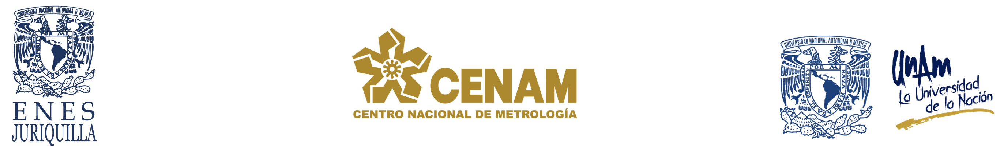
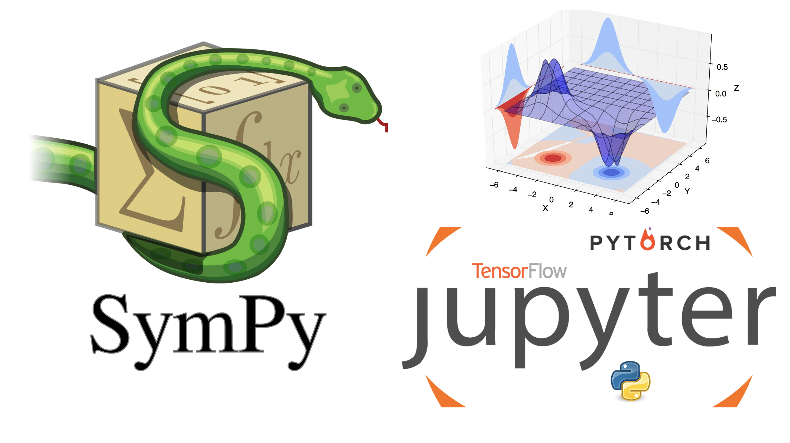

 # Ciencia de Datos un Enfoque Práctico 

## Fecha y horario
#### Fechas: 11 - 13 de diciembre de 2023
#### Horario: 09:00 a 13:00 horas.
#### Lugar: Centro Nacional de Metrología (CENAM)

## Página con recursos adicionales
[www.hpclab.unam.mx/course/python](http://www.hpclab.unam.mx/course/python)

## Prerequisitos
<ol>
  <li>Computadora personal</li> 
  <li> Cuenta de Gmail</li>
  <li>Conexión a internet</li>
  <li>Explorar </li>
</ol>

## Impartido por:

+ [Dr. Ulises Olivares Pinto](www.hpclab.unam.mx)

## Temario, materiales y videos

| Día  | Tema                                  | Contenido                                   | Material                                                                                                                                                                                                                             | Videos                                                                                      | Materiales Complementarios                                                                                                       |
|------|---------------------------------------|--------------------------------------------|--------------------------------------------------------------------------------------------------------------------------------------------------------------------------------------------------------------------------------------|----------------------------------------------------------------------------------------------|---------------------------------------------------------------------------------------------------------------------------------|
| Día 1 | Instalación de Prerrequisitos (Opcional) | Instalación de:<ul><li>Python</li><li>Jupyter</li><li>Librerías</li></ul> | <ul><li>[Ver página](http://www.hpclab.unam.mx/course/python)</li> <li>[Código Día 1](https://colab.research.google.com/drive/1uG12tFB6h7ff57_Clem0O09Q3cJck1jr?usp=sharing)</li> <li>[Presentación](pdf/Di%CC%81a1.pdf)</li></ul> | <li>[Video de instalación](https://www.youtube.com/watch?v=1ETiwXo0lg4&feature=emb_title)</li> | <ul><li>Libro: ["Python Crash Course, 3rd Edition"](https://bedford-computing.co.uk/learning/wp-content/uploads/2015/10/No.Starch.Python.Oct_.2015.ISBN_.1593276036.pdf) por Eric Matthes</li><li>Tutorial de Jupyter Notebook en [Dataquest](https://www.dataquest.io/blog/jupyter-notebook-tutorial/), [Real Python](https://realpython.com/jupyter-notebook-introduction/), y [DataCamp](https://www.datacamp.com/community/tutorials/tutorial-jupyter-notebook)</li></ul> |
| Día 2 | Redes Neuronales Convolucionales           | Convoluciones                               | <ul><li>[Código Día 2](https://colab.research.google.com/drive/16eKMFT6LUJVNdFdm7YMX4IPA_79AVZjf?usp=sharing)</li> <li>[Presentación Día 2](pdf/Día2.pdf)</li></ul>| | <ul><li>Libro: "Deep Learning" por Goodfellow, Bengio, Courville</li> <li>Artículo: "A Guide to Convolutional Neural Networks for Computer Vision" en [Super Data Science](https://www.superdatascience.com/blogs/the-ultimate-guide-to-convolutional-neural-networks-cnn)</li> <li>Curso de CNN en [Coursera](https://www.coursera.org/learn/convolutional-neural-networks) por deeplearning.ai</li></ul> |

##### Última modificación: 13 de diciembre de 2023
